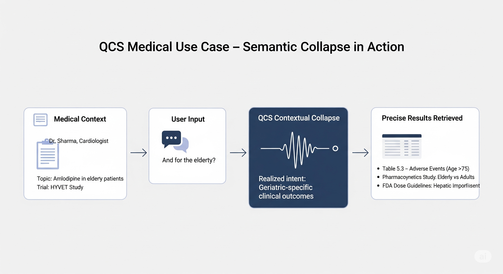
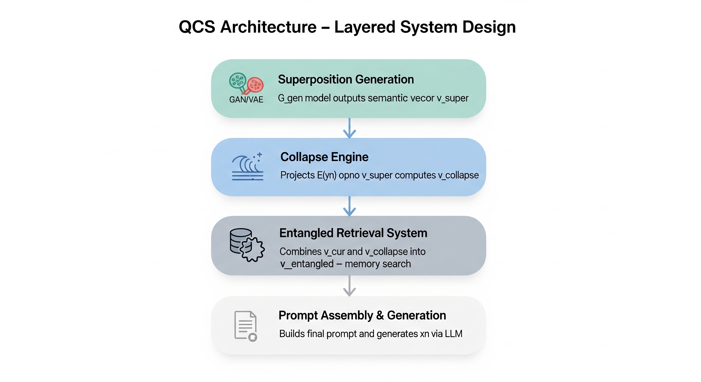

[](https://doi.org/10.5281/zenodo.16263487)

---
# Quantum Contextual Superposition (QCS) Framework

The **Quantum Contextual Superposition (QCS)** framework proposes a next-generation approach to conversational AI. By treating future user responses as a **semantic probability cloud** and collapsing it when actual input is received, QCS achieves higher relevance, precision, and proactivity in dialogue.

---

## 📘 Overview

QCS transforms reactive dialogue agents into anticipatory systems by:

- Predicting a **superposition vector** representing the semantic space of possible next responses.
- Projecting the user’s actual reply to "collapse" that superposition.
- Combining this with the immediate past to form an **entangled retrieval vector**.

This allows systems to "understand what the user is likely to say" *before* they say it.

---

## 🧠 Quantum-Inspired Principles

| Quantum Principle     | QCS Equivalent                                                                 |
|-----------------------|--------------------------------------------------------------------------------|
| Superposition         | Vector encoding all probable semantic directions of next user input            |
| Measurement Collapse  | Projection of actual input onto superposition to isolate realized intent       |
| Entanglement          | Fusion of past turn and collapsed future into a single high-relevance query    |

---

## 🧪 Core Components

### 1. Superposition Generator (`G_gen`)
- Lightweight GAN or VAE trained on multi-turn conversation data.
- Predicts next-turn **semantic centroid** from context history.

### 2. Contextual Collapse via Projection
- Embeds user reply.
- Projects it onto `v_super` to yield `v_collapse`.

### 3. Entangled Query Vector
- Fuses past turn and collapsed future for memory retrieval.

\[
v_{\text{entangled}} = \beta \cdot v_{\text{cur}} + (1 - \beta) \cdot v_{\text{collapse}}
\]

---

## 🧬 Full Pipeline (with Diagram)


**Step-by-step Flow:**

1. **Post-AI Response:**
   - Predict `v_super` from current context `C_n` using `G_gen`.

2. **On User Input:**
   - Embed actual user input `E(y_n)`
   - Compute projection: `v_collapse = project(v_super, E(y_n))`
   - Embed current complete turn `v_cur = embed(x_{n-1} + y_n)`
   - Fuse vectors: `v_entangled = β · v_cur + (1 - β) · v_collapse`

3. **Semantic Retrieval:**
   - Use `v_entangled` for ANN search in memory store.
   - Retrieve `R_n`, build prompt `P_n`.

4. **LLM Generation:**
   - Generate `x_n = LLM(P_n)`

---

## 🔧 Pseudocode

```python
# Proactive step (while user reads last AI response)
v_super = G_gen(C_n)

# After user replies
E_y = embed(y_n)
v_collapse = project(v_super, E_y)
v_cur = embed(x_{n-1} + y_n)
v_entangled = beta * v_cur + (1 - beta) * v_collapse

# Retrieval & generation
R_n = retrieve_from_memory(v_entangled)
P_n = construct_prompt(C_n, R_n)
x_n = LLM(P_n)
````

---

## 🩺 Example: Medical Expert Assistant

**Context:** Geriatric cardiologist researching Amlodipine.

**User query:** "And for the elderly?"

### Without QCS:

Returns general data on Amlodipine in elderly.

### With QCS:

Returns:

* Table 5.3 from HYVET trial on 75+ adverse effects
* Study on pharmacokinetics in elderly
* FDA dosage guidelines for hepatic impairment



---

## 🧠 Architectural Layers

### QCS Layered Design



* **Layer 1: Superposition Modeling**

  * G\_gen handles semantic forecasting.
* **Layer 2: Collapse Logic**

  * Vector projection logic computes realization of user intent.
* **Layer 3: Retrieval Engine**

  * Entangled vector powers high-precision semantic memory search.
* **Layer 4: LLM Orchestration**

  * Uses fused prompt to generate coherent, informed responses.

---

## 🎯 Benefits

- ✅ **Precision:** Retrieves specific, relevant info even from vague input.  
- ⚡ **Efficiency:** Replaces costly LLM with lightweight generator for anticipation.  
- 🔍 **Ambiguity-Resilience:** Vague replies like "why?" still produce relevant retrievals.  
- 🧩 **Elegant Design:** Modular architecture, deterministic behavior, better debugging.  

---

[](https://doi.org/10.5281/zenodo.16263487)

## 📖 Citation

If you reference this framework in academic or technical work, please cite:

**Mekala, Vishal Chowdary.** (2025). *The Quantum Contextual Superposition (QCS) Algorithm*. Zenodo.  
🔗 [https://doi.org/10.5281/zenodo.16263487](https://doi.org/10.5281/zenodo.16263487)

<details>
<summary>📚 <strong>BibTeX</strong> 

```bibtex
@misc{mekala2025qcs,
  author       = {Mekala, Vishal Chowdary},
  title        = {The Quantum Contextual Superposition (QCS) Algorithm},
  year         = {2025},
  publisher    = {Zenodo},
  doi          = {10.5281/zenodo.16263487},
  url          = {https://doi.org/10.5281/zenodo.16263487}
}

````

---
## 📚 References

* [QCS: The Quantum Contextual Superposition Algorithm](https://drive.google.com/file/d/1CwLmDByw1G7twOc0BWrwfFWLnFMhfjz2/view?usp=sharing)
* [Mathematical Formalization of Conversational Engineering](https://drive.google.com/file/d/1ZCfYLU5UTa4zdqi7NbRseH45lR18xVnH/view?usp=sharing)

---

## 📌 Project Status

* 🚧 QCS is a **theoretical framework**
* 🧠 Intended for researchers, architects, and experimentalists
* 🛠️ No implementation or software dependencies required

---

## 🧭 License
This work is licensed under the  
**Creative Commons Attribution-NonCommercial-ShareAlike 4.0 International (CC BY-NC-SA 4.0)**.  
You are free to:

- **Share** — copy and redistribute the material in any medium or format  
- **Adapt** — remix, transform, and build upon the material  

Under the following terms:

- **Attribution** — You must give appropriate credit, provide a link to the license, and indicate if changes were made.
- **NonCommercial** — You may not use the material for commercial purposes.
- **ShareAlike** — If you remix, transform, or build upon the material, you must distribute your contributions under the same license.

📄 [View License](https://creativecommons.org/licenses/by-nc-sa/4.0/)  
🔗 SPDX Identifier: `CC-BY-NC-SA-4.0`

© 2025 **Mekala, Vishal Chowdary.** *The Quantum Contextual Superposition (QCS) Algorithm*
