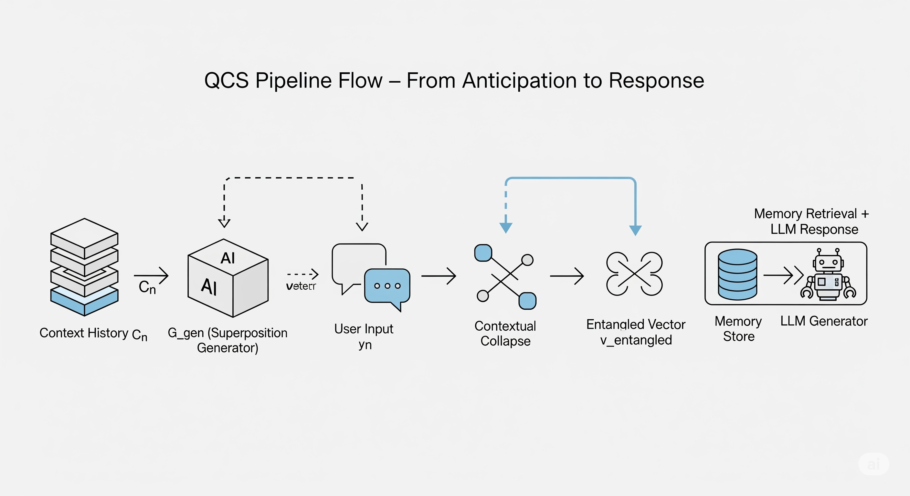

# Quantum Contextual Superposition (QCS) Framework

The **Quantum Contextual Superposition (QCS)** framework proposes a next-generation approach to conversational AI. By treating future user responses as a **semantic probability cloud** and collapsing it when actual input is received, QCS achieves higher relevance, precision, and proactivity in dialogue.

---

## 📘 Overview

QCS transforms reactive dialogue agents into anticipatory systems by:

- Predicting a **superposition vector** representing the semantic space of possible next responses.
- Projecting the user’s actual reply to "collapse" that superposition.
- Combining this with the immediate past to form an **entangled retrieval vector**.

This allows systems to "understand what the user is likely to say" *before* they say it.

---

## 🧠 Quantum-Inspired Principles

| Quantum Principle     | QCS Equivalent                                                                 |
|-----------------------|--------------------------------------------------------------------------------|
| Superposition         | Vector encoding all probable semantic directions of next user input            |
| Measurement Collapse  | Projection of actual input onto superposition to isolate realized intent       |
| Entanglement          | Fusion of past turn and collapsed future into a single high-relevance query    |

---

## 🧪 Core Components

### 1. Superposition Generator (`G_gen`)
- Lightweight GAN or VAE trained on multi-turn conversation data.
- Predicts next-turn **semantic centroid** from context history.

### 2. Contextual Collapse via Projection
- Embeds user reply.
- Projects it onto `v_super` to yield `v_collapse`.

### 3. Entangled Query Vector
- Fuses past turn and collapsed future for memory retrieval.

\[
v_{\text{entangled}} = \beta \cdot v_{\text{cur}} + (1 - \beta) \cdot v_{\text{collapse}}
\]

---

## 🧬 Full Pipeline (with Diagram)



**Step-by-step Flow:**

1. **Post-AI Response:**
   - Predict `v_super` from current context `C_n` using `G_gen`.

2. **On User Input:**
   - Embed actual user input `E(y_n)`
   - Compute projection: `v_collapse = project(v_super, E(y_n))`
   - Embed current complete turn `v_cur = embed(x_{n-1} + y_n)`
   - Fuse vectors: `v_entangled = β · v_cur + (1 - β) · v_collapse`

3. **Semantic Retrieval:**
   - Use `v_entangled` for ANN search in memory store.
   - Retrieve `R_n`, build prompt `P_n`.

4. **LLM Generation:**
   - Generate `x_n = LLM(P_n)`

---

## 🔧 Pseudocode

```python
# Proactive step (while user reads last AI response)
v_super = G_gen(C_n)

# After user replies
E_y = embed(y_n)
v_collapse = project(v_super, E_y)
v_cur = embed(x_{n-1} + y_n)
v_entangled = beta * v_cur + (1 - beta) * v_collapse

# Retrieval & generation
R_n = retrieve_from_memory(v_entangled)
P_n = construct_prompt(C_n, R_n)
x_n = LLM(P_n)
🩺 Example: Medical Expert Assistant
Context: Geriatric cardiologist researching Amlodipine.

User query: "And for the elderly?"

Without QCS:
Returns general data on Amlodipine in elderly.

With QCS:
Returns:

Table 5.3 from HYVET trial on 75+ adverse effects

Study on pharmacokinetics in elderly

FDA dosage guidelines for hepatic impairment


🧠 Architectural Layers
QCS Layered Design

Layer 1: Superposition Modeling

G_gen handles semantic forecasting.

Layer 2: Collapse Logic

Vector projection logic computes realization of user intent.

Layer 3: Retrieval Engine

Entangled vector powers high-precision semantic memory search.

Layer 4: LLM Orchestration

Uses fused prompt to generate coherent, informed responses.

🎯 Benefits
✅ Precision: Retrieves specific, relevant info even from vague input.

⚡ Efficiency: Replaces costly LLM with lightweight generator for anticipation.

🔍 Ambiguity-Resilience: Vague replies like "why?" still produce relevant retrievals.

🧩 Elegant Design: Modular architecture, deterministic behavior, better debugging.

📚 References
QCS: The Quantum Contextual Superposition Algorithm

Mathematical Formalization of Conversational Engineering

📌 Project Status
🚧 QCS is a theoretical framework
🧠 Intended for researchers, architects, and experimentalists
🛠️ No implementation or software dependencies required

🧾 Citation
bibtex
Copy
Edit
@article{qcs2025,
  title={Quantum Contextual Superposition: Anticipatory Dialogue through Probabilistic Collapse},
  author={Chowdary, Vishal and Team},
  year={2025},
  note={Preprint}
}
🖼️ Diagram Credits
qcs_pipeline.png: Visual flow of QCS from superposition to generation.

qcs_medical_example.png: Diagram of collapse process in medical AI.

qcs_architecture_layers.png: System architecture of QCS in layered form.

Please generate or request these illustrations based on provided descriptions.

🧭 License
TBD. For academic use only. Contact author for collaboration.
